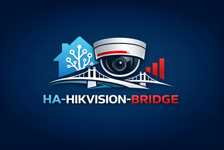

<p align="center">
  
</p>

<h1 align="center">ha-hikvision-bridge</h1>
<p align="center"><strong></strong></p>
<a href="https://github.com/skstussy/hikvision-ptz">
  
</a>
<p align="center"><em>Bridging the gap between hardware reality and ISAPI standards.</em></p>

<p align="center">
  <a href="https://github.com/skstussy/ha-hikvision-bridge/releases"></a>
  <a href="https://img.shields.io/github/downloads/skstussy/ha-hikvision-bridge/latest/total?style=for-the-badge&logo=home-assistant&logoColor=white"></a>
  <a href="https://github.com/skstussy/ha-hikvision-bridge"></a>
  <a href="https://www.hacs.xyz/"></a>
</p>

<p align="center">
  <a href="https://github.com/skstussy/ha-hikvision-bridge"></a>
  <a href="https://github.com/skstussy/ha-hikvision-bridge/issues"></a>
  <a href="https://github.com/skstussy/ha-hikvision-bridge/releases"></a>
</p>

<p align="center">
  <a href="https://github.com/skstussy/ha-hikvision-bridge">Documentation</a> •
  <a href="https://github.com/skstussy/ha-hikvision-bridge/issues">Report Bug</a> •
  <a href="https://github.com/skstussy/ha-hikvision-bridge/issues">Request Feature</a>
</p>

---

## 🔥 Recent Progress Snapshot

- ✅ Full PTZ control stack: Pan, Tilt, Zoom, Focus, and Iris
- ✅ Alarm, storage, HDD, motion, and DVR visibility surfaced into Home Assistant
- ✅ Stream Info, Stream Mode Info, Alarm Dashboard, and NVR Storage Info support
- ✅ Accent and tint synchronization fixes for storage panels
- ✅ Professional documentation and support links in place
- 🚧 NVR recording playback workflow actively in development
- 🔜 Audio, reboot testing, and walkie-talkie features on the roadmap

## 🚀 Priority Support

Support this project to receive priority attention and direct influence on the roadmap.

- 🥇 Bug reports investigated first
- 🧠 Feature requests reviewed first
- 🔍 Faster feedback on your use case
- 🎯 Direct input on what gets built next

## ☕ Wall of Fame

These legends help fuel development.

- 🥇 This could be you
- 🥈 This could be you
- 🥉 This could be you

[](https://ko-fi.com/skstussy43571)
[](https://www.paypal.com/donate/?hosted_button_id=G2PU9CH6A53HU)

## Why this integration exists

A lot of Hikvision setups expose a gap between what the documentation says should work and what actually works on real hardware.

In practice, users often run into one or more of these problems:

- PTZ works poorly or not at all through ONVIF
- Standard ISAPI capability queries report PTZ as unsupported
- The official Hikvision app still cannot reliably control PTZ on some systems
- DVR and NVR proxy routing behaves differently from direct camera endpoints
- Main stream, sub-stream, RTSP, and WebRTC paths do not all behave the same way

This integration is written with those realities in mind. Instead of assuming the cleanest documented path is the correct one, it is built around tested ISAPI proxy endpoints and working behavior observed on real devices.

## 🤝 Included Lovelace card

This repository now bundles both parts of the project in a **single repo**:

- **Backend integration** under `custom_components/ha-hikvision-bridge`
- **Full Hikvision PTZ Lovelace card** as `ha-hikvision-bridge-card.js`

The integration provides the backend logic, entities, services, and attributes. The bundled card provides the polished dashboard experience.

> Future plan: this repo will eventually ship **two cards** — the current full-featured card and a smaller lite card with limited features.


## 🤖 Built with GenAI

This project is also a practical example of what modern AI-assisted development can make possible.

> This repository was written approximately **99% with Generative AI**, across hundreds of prompted rewrites, code reviews, bug-fix passes, UI iterations, and architecture corrections.

The human behind the project is not a Home Assistant application developer and does not consider himself a strong coder. With curiosity, persistence, testing, and AI collaboration, he was still able to build a working custom integration in a short time.

That is worth stating plainly because it reflects the moment we are living in: people with enough curiosity and enough iteration can now build things that used to feel out of reach.

## ✨ Features

### 🎮 PTZ control
- Directional **Pan / Tilt**
- **Zoom + / -**
- **Focus + / -**
- **Iris + / -**
- PTZ services for automations and scripts
- Preset navigation
- PTZ return-to-center and correction flow

### 🎥 Live streaming
- **RTSP**
- **Direct RTSP**
- **WebRTC**
- **WebRTC via direct RTSP path**
- Snapshot fallback mode
- Main-stream and sub-stream handling where supported

### 📼 Recording playback
- ISAPI recording search route: `POST /ISAPI/ContentMgmt/search`
- Start playback from a requested date and time
- Playback stop service
- Playback-aware UI behavior for switching between live and recorded content
- Planned robust seeking approach: re-query and restart playback at the requested timestamp instead of relying on fragile native scrubbing inside one continuous session
- Planned configurable skip presets such as 1s, 5s, 10s, 30s, 1m, 5m, 10m, and 60m

### 🚨 System visibility
- Alarm sensors via `/ISAPI/System/IO/inputs`
- Motion and event sensor support where available
- Alarm dashboard support
- NVR and DVR information surfaced into Home Assistant
- Storage, disk, and HDD visibility
- Camera and stream metadata exposed through entity attributes

### 🧩 Home Assistant friendly
- Config flow support
- Local polling architecture
- Entity-driven UI support
- Service-based actions for dashboards, scripts, and automations
- Structured backend data for a dedicated Lovelace frontend

## 🧠 Development status

### ✅ Completed
- Enable and validate Iris and Focus controls
- Alarm sensors
- HDD sensors
- Disk space visibility
- Motion and related sensors where supported
- Restore DVR and storage sensors to their proper sections
- Move Channel Stream selector into Stream Info
- Add Stream Mode Info section
- Move Stream Mode selector into Stream Mode Info
- Improve Alarm Dashboard display
- Fix accent selector support on HDD elements inside NVR Storage Info
- Professional README upgrade
- Payment and support links setup

### 🚧 In progress

#### Access to NVR recordings
- Query recordings using `POST /ISAPI/ContentMgmt/search`
- Start playback using the returned `playbackURI`
- Add UI controls for back, forward, pause, and preset seek sizes
- Use the robust restart-at-timestamp approach for seeking

## 📦 What the integration provides

Depending on your hardware and configuration, the integration can expose:

- camera entities
- stream-related sensors
- alarm-related sensors
- binary sensors
- DVR and NVR information entities
- storage information entities
- playback service controls

The exact entity set depends on device model, firmware behavior, enabled streams, and channel availability.

## 🛠 Services

### Core PTZ services
- `ha-hikvision-bridge.ptz`
- `ha-hikvision-bridge.goto_preset`
- `ha-hikvision-bridge.zoom`
- `ha-hikvision-bridge.focus`
- `ha-hikvision-bridge.iris`
- `ha-hikvision-bridge.ptz_return_to_center`

### Playback services
- `ha-hikvision-bridge.playback_seek`
- `ha-hikvision-bridge.playback_stop`

## 🚀 Installation

### Option 1 — HACS (recommended)

Install the integration from this repo first. The repository also includes the bundled Lovelace card source (`ha-hikvision-bridge-card.js`) so the project can now be maintained from one place.

1. Open **HACS**
2. Go to **Integrations**
3. Open the menu in the top-right corner
4. Select **Custom repositories**
5. Add:

   ```text
   https://github.com/skstussy/ha-hikvision-bridge
   ```

6. Choose category: **Integration**
7. Install the repository
8. Restart Home Assistant

### Option 2 — Manual install

1. Download the latest release archive
2. Extract the folder:

   ```text
   custom_components/ha-hikvision-bridge
   ```

3. Copy it into your Home Assistant config directory:

   ```text
   /config/custom_components/ha-hikvision-bridge
   ```

4. Restart Home Assistant

## ⚙️ Configuration

After installation:

1. Go to **Settings → Devices & Services**
2. Click **Add Integration**
3. Search for **Hikvision PTZ**
4. Enter the DVR or NVR connection details
5. Complete setup and allow entity creation

## 🧠 Usage

### Dashboard usage
For the best experience, pair this integration with the companion card.

- backend, entities, and services → **this repository**
- frontend, dashboard controls, and polished UI → **ha-hikvision-bridge-card**

### Automation usage
These services can be used in:

- automations
- scripts
- dashboard button cards
- custom panels

### Example service call: playback seek

```yaml
service: ha-hikvision-bridge.playback_seek
target:
  entity_id: camera.front_yard
data:
  timestamp: "2026-04-01T14:05:00"
```

### Example service call: playback stop

```yaml
service: ha-hikvision-bridge.playback_stop
target:
  entity_id: camera.front_yard
```

## 🔐 ISAPI prerequisites

These are strongly recommended for stable setup.

- Authentication set to **Digest / Basic**
- **Virtual Host** enabled on the DVR or NVR
- Camera Virtual Host endpoints enabled and reachable
- DVR and camera credentials synced manually where possible
- Main and sub streams configured consistently across cameras
- PTZ channels mapped correctly

### Recommended setup pattern

1. Configure and validate the DVR or NVR first
2. Confirm Virtual Host access for each camera
3. Confirm live stream availability
4. Install this integration
5. Install the companion card
6. Test PTZ, stream mode switching, and playback
7. Refine the dashboard once the backend is stable

## 📌 Roadmap / backlog

### Test rebooting and add reboot feature if stable
Endpoint under evaluation:

```xml
POST /ISAPI/System/reboot
<?xml version="1.0" encoding="UTF-8"?>
<reboot/>
```

### Add controls for speaker and microphone
- Speaker volume control
- Microphone volume control
- Fix volume mismatch compared with the Hikvision app
- Required groundwork before JavaScript PTZ and audio control expansion

### Walkie-talkie over ISAPI and WebRTC
- Build a native implementation instead of depending on WebRTC Camera Card
- Refer to go2rtc and WebRTC Camera Card patterns only as implementation references

### PTZ control element refinement
- Build a cleaner one-object control experience in the custom Lovelace card using LitElement

### Auto tracking
- Add Frigate support first
- Then evaluate plug-and-play tracking via Frigate topics or built-in tracking approaches

### Debug system
- Filterable logging for categories such as playback, PTZ, and streaming
- Focus on non-200 request and response logging

## ⚠️ Notes and limitations

- Hikvision behavior varies significantly by model and firmware
- Some ISAPI features are documented but not actually supported in practice
- Some cameras do not support autofocus or other advanced functions over ISAPI
- Playback depends on recordings actually existing at the requested timestamp
- WebRTC behavior can still depend on your Home Assistant stream environment and network path

## 🧪 Best fit

This integration is especially useful for users who:

- need PTZ to work on Hikvision systems where ONVIF is not enough
- prefer observed working behavior over clean spec assumptions
- want a Home Assistant-native workflow for both live and recorded views
- are building a polished dashboard around Hikvision camera control

## 🙌 Final note

This repository exists because of persistence, testing, many rewrites, and a willingness to keep going until the behavior matched the real hardware.

> With enough curiosity and enough iteration, people can now build far more than they could before.

If this project helps you, a star, issue report, support, or contribution is appreciated.


## 🎛 Bundled Lovelace card

This repository includes the current full Hikvision PTZ dashboard card as:

```text
ha-hikvision-bridge-card.js
```

That lets you maintain the backend integration and the card from a single GitHub repo going forward.

### Current bundled card install

Because this merged package intentionally avoids changing existing functionality code, card loading remains documented and explicit:

1. Copy `ha-hikvision-bridge-card.js` into your Home Assistant `www` directory, for example:

   ```text
   /config/www/ha-hikvision-bridge-card.js
   ```

2. Add the Lovelace resource:

   ```text
   /local/ha-hikvision-bridge-card.js
   ```

3. Add the card to a dashboard:

   ```yaml
   type: custom:ha-hikvision-bridge-card
   title: Front Yard PTZ
   auto_discover: true
   ```

> The next planned stage is a smaller lite card with limited features, delivered from this same repository.
