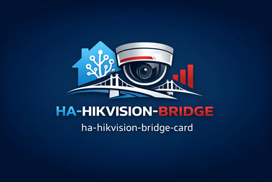

<p align="center">
  
</p>

<h1 align="center">hikvision-bridge-card </h1>
<p align="center"><strong>Professional Lovelace control surface for ha-hikvision-bridge integration</strong></p>
<p align="center"><em>Clean dashboard controls for live view, PTZ, playback, alarms, and storage visibility.</em></p>

<p align="center">
  <a href="https://github.com/skstussy/ha-hikvision-bridge-card/releases"></a>
  <a href="https://img.shields.io/github/downloads/skstussy/ha-hikvision-bridge-card/latest/total?style=for-the-badge&logo=home-assistant&logoColor=white"></a>
  <a href="https://github.com/skstussy/ha-hikvision-bridge-card"></a>
  <a href="https://www.hacs.xyz/"></a>
</p>

<p align="center">
  <a href="https://github.com/skstussy/ha-hikvision-bridge-card"></a>
  <a href="https://github.com/skstussy/ha-hikvision-bridge-card/issues"></a>
  <a href="https://github.com/skstussy/ha-hikvision-bridge-card/releases"></a>
</p>

<p align="center">
  <a href="https://github.com/skstussy/ha-hikvision-bridge-card">Documentation</a> •
  <a href="https://github.com/skstussy/ha-hikvision-bridge-card/issues">Report Bug</a> •
  <a href="https://github.com/skstussy/ha-hikvision-bridge-card/issues">Request Feature</a>
</p>

---

## 🔥 Recent Progress Snapshot

- ✅ Unified PTZ controls for Pan, Tilt, Zoom, Focus, and Iris
- ✅ Stream Info and Stream Mode Info split into cleaner dashboard sections
- ✅ Improved Alarm Dashboard display
- ✅ Storage panel accent and tint synchronization fixes
- ✅ Better mobile-aware layout direction
- 🚧 Playback controls and recording access UI in progress
- 🔜 Audio and walkie-talkie controls planned

## 🚀 Priority Support

Support this project to receive priority attention and direct influence on the roadmap.

- 🥇 Bug reports investigated first
- 🧠 Feature requests reviewed first
- 🔍 Faster feedback on your use case
- 🎯 Direct input on what gets built next

## ☕ Wall of Fame

These legends help fuel development.

- 🥇 This could be you
- 🥈 This could be you
- 🥉 This could be you

[](https://ko-fi.com/skstussy43571)
[](https://www.paypal.com/donate/?hosted_button_id=G2PU9CH6A53HU)

## What this card is

A custom **Lovelace dashboard card** for the Hikvision PTZ integration, built to provide an elegant control surface for live viewing, PTZ actions, playback workflows, and rich system information inside Home Assistant.

This card is now bundled inside the main **Hikvision PTZ** repository so the backend and Lovelace UI can be versioned together from one place:

**Hikvision PTZ (ISAPI Proxy)**  
https://github.com/skstussy/ha-hikvision-bridge-card

## Why this card exists

The backend integration exposes the entities, attributes, and services. This card turns those capabilities into a practical day-to-day operator interface.

It is built for users who want more than a basic camera tile:

- a cleaner PTZ workflow
- stream profile switching
- stream mode switching
- playback controls
- rich channel, stream, and DVR visibility
- a more polished and mobile-aware experience

## ✨ Features

### 🎮 Unified controls
- PTZ controls
- Zoom, Focus, and Iris controls
- Adjustable PTZ speed
- Optional controls toggle mode
- Mobile-friendly layout improvements
- Position and state visibility where available

### 🎥 Live video handling
- WebRTC support
- RTSP support
- Direct RTSP path support
- Snapshot mode support
- Playback-aware rendering

### 📼 Playback UI
- Designed to support recorded playback workflows from the backend integration
- Planned back, forward, pause, and preset seek controls
- Planned robust restart-at-timestamp seek behavior

### 🧾 Information panels
- Camera Information
- Channel Stream Info
- Stream Mode Info
- DVR and NVR Information
- NVR Storage Info
- Alarm Dashboard

### 🎨 UI customization
- Accent color support
- Panel tint support
- Per-section visibility toggles
- Cleaner operator-focused layout
- Configurable always-visible or toggleable controls behavior

## 🧠 Design goals

This card is meant to feel like a professional control panel, not a stack of unrelated buttons.

Design goals include:

- keeping controls visually connected
- reducing clutter
- making stream switching easier to understand
- presenting diagnostics without overwhelming the main view
- making the card feel premium on both desktop and mobile

## 🚀 Installation

### Step 1 — Install the backend integration first

This card expects entities and attributes provided by:

```text
https://github.com/skstussy/ha-hikvision-bridge-card
```

Install and configure the integration before adding the card.

### Step 2 — Install the bundled card

This repository now carries the card source directly as `hikvision-ptz-card.js`.

#### Current install path

1. Copy `hikvision-ptz-card.js` from this repo into:

   ```text
   /config/www/hikvision-ptz-card.js
   ```

2. Open **Settings → Dashboards → Resources**
3. Add a new resource:

   - **URL:** `/local/hikvision-ptz-card.js`
   - **Type:** `JavaScript Module`

4. Refresh the browser

> This keeps the project in one repo today without modifying the existing functional code path. Future work can make card loading more automatic from the integration side.


## 🧠 Basic usage

Add the card to a dashboard:

```yaml
type: custom:hikvision-ptz-card
title: Front Yard PTZ
auto_discover: true
speed: 50
repeat_ms: 350
controls_mode: always
accent_color: "#03a9f4"
panel_tint: 8
show_camera_info: true
show_stream_info: true
show_dvr_info: true
show_storage_info: true
show_position_info: true
```

## ⚙️ What the card can show

Depending on the entities and attributes available from the integration, the card can surface:

- current camera selection
- live stream state
- main or sub-stream choice
- stream mode selection
- RTSP or direct RTSP path preference
- playback state
- alarm stream status
- DVR or NVR identity details
- storage and disk summary
- alarm dashboard details

## 🧩 Recommended pairing

Best results come from using both repositories together:

- **integration repo** for setup, entity creation, backend logic, and services
- **card repo** for dashboard control and presentation

Together they form the complete experience.

## 📱 Mobile and dashboard design goals

This card has been iterated heavily to feel more refined in actual use, especially on compact screens.

It is being pushed toward a true one-object control experience where PTZ, Zoom, Focus, Iris, and speed controls feel like one unified interface instead of floating pieces.

## 📌 Roadmap / backlog

### Playback controls
- Add recorded playback controls to match backend progress
- Add configurable seek presets
- Keep playback UX predictable and robust

### Audio controls
- Speaker controls
- Microphone controls
- Walkie-talkie UI

### PTZ control refinement
- Continue refining the single control element
- Improve mobile layout stability and overall polish
- Consider Lit-based interaction upgrades where useful

### Smart features
- Surface future auto-tracking features from the backend
- Improve event-driven UI feedback

## 📌 Notes

- Functionality depends on the backend integration exposing the expected entities and attributes
- Some stream modes depend on your Home Assistant environment and supporting components
- Direct WebRTC workflows may need a compatible WebRTC resource in the dashboard stack
- Exact behavior can vary based on DVR, camera model, stream setup, and firmware quirks

## 🙌 Final note

This card is meant to make the Hikvision PTZ integration feel complete inside Home Assistant.

If the backend makes the system work, this card makes it pleasant to use.
